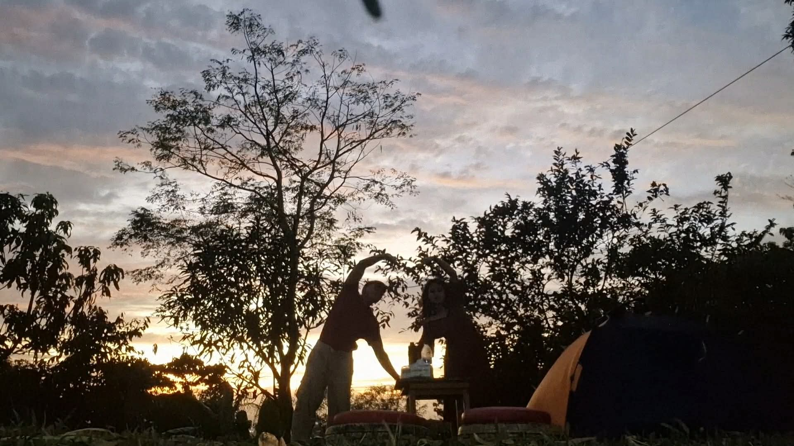

<!DOCTYPE html>
<html lang="en">
<head>
    <meta charset="UTF-8">
    <meta name="viewport" content="width=device-width, initial-scale=1.0">
    <title>Mahal</title>
    
</head>
<body>

    

        <audio controls loop autoplay>
            <source src="https://www.soundhelix.com/examples/mp3/SoundHelix-Song-1.mp3" type="audio/mpeg">
            Your browser does not support the audio element.
        </audio>
    

    <header>
        

            <h1>Our Magical World</h1>
            
Every single moment spent with you feels exactly like a fairytale.

        

    </header>

    <section id="story">
        

            <h2 class="section-title">Our Captured Memories</h2>
        

    </section>

    <section id="gallery">
        

            

                

                    
                

                

                    
                

                

                    
                

                

                    
                

                

                    
                

                

                    
                

                

                    
                

                

                    
                

            

        

    </section>

    <section id="message">
        

            <h2 class="section-title">I Love You So Much</h2>
            

                
"You are my favorite song, my brightest star, and my home. No matter where we go or what we do, my heart is completely yours forever and always. Thank you for loving me."

            

        

    </section>

    <footer>
        
Made with magic and ✨ for my favorite person.

    </footer>

</body>
</html>
